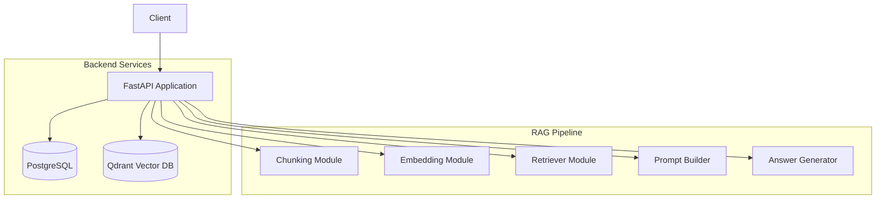

# 초기 아키텍처

## 시스템 구성도

## 기술 스택
- **Backend Framework**: FastAPI (Python 3.11+)
- **Relational Database**: PostgreSQL (메타데이터, 문서 정보, 사용자 히스토리 등 저장)
- **Vector Database**: Qdrant (텍스트 임베딩 벡터 저장 및 시맨틱 검색)
- **Infrastructure**: Docker & Docker Compose (컨테이너화 및 오케스트레이션)

## 모듈 분리 정책 (RAG)
LangChain과 같은 무거운 프레임워크 대신, RAG의 각 과정을 이해하고 통제할 수 있도록 모듈을 분리합니다.

1. **Chunking**: 원본 문서를 의미 있는 단위(Chunk)로 분할합니다.
2. **Embedding**: 텍스트 청크를 임베딩 모델을 통해 벡터로 변환합니다.
3. **Vector Store**: Qdrant와 통신하여 벡터를 저장하고 쿼리하는 역할을 담당합니다.
4. **Retriever**: 사용자 질문에 대해 가장 관련성 높은 문서를 검색합니다.
5. **Prompt Builder**: 검색된 문서와 사용자 질문을 조합하여 LLM에 전달할 프롬프트를 구성합니다.
6. **Answer Generator**: LLM API를 호출하여 최종 답변을 생성합니다.
